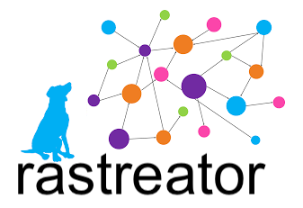

#### > Tool with a collection of query files to explore Microsoft Active Directory


## Contents

1. [What is rastreator?](#1-what-is-rastreator)
2. [What does rastreator solve?](#2-what-does-rastreator-solve)
3. [Interesting features](#3-interesting-features)
4. [Goals](#4-goals)
5. [Collection of query files](#5-collection-of-query-files)
6. [Query file](#6-query-file)
7. [Tool](#7-tool)
    1. [Audit mode](#71-audit-mode)
    2. [Check mode](#72-check-mode)
    3. [Execute mode](#73-execute-mode)
    4. [Path mode](#74-path-mode)
    5. [Shell mode](#75-shell-mode)
8. [Installation](#8-installation)
    1. [Dependencies](#81-dependencies)
    2. [Using Git](#82-using-git)
    3. [Using Docker](#83-using-docker)
9. [FAQ](#9-faq)
10. [Similar projects](#10-similar-projects)


## 1. What is rastreator?

Rastreator is a tool with a collection of query files to obtain information, suggest potential attacks and discover issues in a Microsoft Active Directory domain.<br/>
Rastreator requires that:
- SharpHound gather Active Directory domain information,
- BloodHound parse the gathered information and fill a Neo4j database.

After that, rastreator depends on:
- Neo4j to store the information and execute Cypher queries to obtain interesting information or issues.

The collection of query files, the core of this project, is grouped by tactics (Mitre ATT&CK) and permissions.<br/>
We encourage everyone to share with us their Cypher statements or query files to improve the collection and the community knowledge.

The tool is a python script (rastreator.py) that executes queries and obtains results.<br/>
It provides different:
- Operation modes to work in background (audit, path), interactively (shell) or programmatically (execute).
- Output formats to analyse the results on screen or save them to disk.


## 2. What does rastreator solve?

[BloodHound](https://github.com/BloodHoundAD/BloodHound) is a great exploration tool and has some awesome queries, like "Shortest path to Domain Admins", but in general, it has three main drawbacks:
- It is not easy to develop and test new queries with it and you end up directly using Neo4j's browser interface for this goal,
- It provides a Linkurious GUI to interact manually but sometimes you need raw data instead of cool graphs and a way to automate a bunch of queries. That's why projects like [CypherDog](https://github.com/SadProcessor/CypherDog) arose,
- It does not have a great collection of queries.

Rastreator solves all of them:
- It has a rich shell mode, to develop and test new queries,
- It provides raw data in different formats (CSV, JSON or YAML),
- It has a good collection of queries to assist Red/Blue Teamers, Pentesters and Auditors,
- It has three operation modes (audit, path and execute) to automate the discovery process in a bunch of queries.


## 3. Interesting features

- Different operation modes: audit, check, execute, path, and shell.
- Different query sub-modes (raw, test and default) that require different internal structure and metadata fields in query files, for those of you more interested in executing Cypher statements than documenting them.
- Metadata for query files, beyond name and description, like for example: author, state, tactic, tag, external references and next steps for Red/Blue Teams.
- Cypher statements in query files that allow placeholder variables to support different domain names, Active Directory languages and starting/ending nodes.
- Different screen output formats: CSV, JSON, table and YAML.
- Different persistence formats: CSV, JSON and YAML.


## 4. Goals

The main goal is to improve the collection of query files. To achieve it we set the following sub-goals:
- Share and centralize query files.
- Research and create new query files.
- Recollect and format, dispersed Cypher statements on the Internet, in query files.
- Promote community collaboration.

Other goals are:
- Remove dependency on BlooHound to parse and fill the Neo4j database.
- Develop a custom ingestor.
- Add Azure query files.


## 5. Collection of query files

The core of this project is a collection of query files under the queries/ directory:
- queries/
    - tactics/
        - collection/
        - credential_access/
        - discovery/
        - execution/
        - lateral\_movement/
        - persistence/
        - privilege\_escalation/
    - permissions/

The tactics/ directory contains query files categorized by the tactics defined in the Mitre ATT&CK Framework. Executing statements in one of these categories provides results to achieve or detect that tactical goal in a domain.<br/>
The permissions/ directory contains query files to detect interesting control permissions of a given start/end node.<br/>
We encourage everyone to participate and share their Cypher statements or query files with us to improve the collection of query files.


## 6. Query file

A query file has a different internal structure depending on the targeted query sub-mode (raw, test, default):

- raw: the query file is a regular text file with one or more Cypher statements, one per line.
- test: the query file is a YAML file that contains required (name and statement-main) and optional (statement-count, statement-graph) metadata.
- default: the query file is a YAML file that contains required and optional metadata.

Next, we will describe the required and optional metadata for a valid query file, required by default in audit/pat modes and candidate to be added to the collection of query files.

Metadata fields:

- author (required): Query author name.
- name (required): Query name using underscores instead of spaces.
- state (required): Only enabled queries will be executed. Valid values (choose one):
    - enabled
    - disabled
- tactic (required): Query tactical goal. Also needed to compute statistics. Valid values (choose one):
    - collection
    - command and control
    - credential access
    - defense evasion
    - discovery
    - execution
    - exfiltration
    - impact
    - initial access
    - lateral movement
    - persistence
    - privilege escalation
- tag (required): Another way to classify queries. Also needed to compute statistics. Valid values (choose one):
    - analysis: queries provide results to analyse.
    - attack: queries provide results with information to perform an attack as the next step.
    - issue: queries provide results pointing to a vulnerability or an incorrect configuration, but also can be used to perform an attack as the next step.
- description (required): Summary of the query purpose.
- reference (optional): List of external URLs with information related to the query.
- nextsteps (optional): List of recommended next steps or tasks for a Red and Blue Team.
- statement (required):
    - main (required): The main Cypher statement of this query file. Results are given as text and can be printed on screen or saved to disk.
    - count (optional): A regular expression that converts the previous main statement into a new one that provides a summary or statistics. Results are given as text and can be printed on screen or saved to disk.
    - graph (optional): A regular expression that converts the previous main statement into a new one that provides a graphical representation. Currently, this query is not executed and the result is a Cypher statement to be copy-pasted and executed in the Neo4j's browser interface.


## 7. Tool

The tool is a python script (rastreator.py) that executes queries and obtains results.
It provides different:
- Operation modes to work in background (audit, path), interactively (shell) or programmatically (execute).
- Output formats to analyse the results on screen or save them to disk.

```
RastreatorTeam@localhost$ python3 rastreator.py -h
usage: rastreator.py [-h] {audit,check,execute,path,shell} ...

Rastreator
 > Tool with a collection of query files to explore Microsoft Active Directory
 > Developed by @interh4ck and @t0-n1

positional arguments:
  {audit,check,execute,path,shell}
    audit               Audit mode
    check               Check mode
    execute             Execute mode
    path                Path mode
    shell               Shell mode

optional arguments:
  -h, --help            show this help message and exit
```

Positional arguments:
- audit: This mode executes in batch mode one or more query files.
- check: This mode checks the correctness of one or more query files.
- execute: This mode executes one Cypher statement passed as a one-liner.
- path: Same as audit mode, but also allows you to specify the source and end nodes.
- shell: This mode provides a REPL shell with autocompletion support from where you can execute multiple Cypher statements in a single session.


### 7.1. Audit mode

This mode finds issues and general information. It runs one or more query files in batch mode. It's possible to execute query files without all the required metadata fields using sub-modes (raw or test).

```
RastreatorTeam@localhost$ python3 rastreator.py audit -h
usage: rastreator.py audit [-h] [-v {quiet,default,debug}] [-H NEO4J_HOST] [-P NEO4J_PORT]
                           [-u NEO4J_USERNAME] [-p NEO4J_PASSWORD] [-e {false,true}] -I
                           INPUT_DIRECTORY_OR_FILE [-O OUTPUT_DIRECTORY]
                           [-o {csv,json,none,yaml}] [-f {csv,json,table,yaml}] [-l {en,es}]
                           -d AD_DOMAIN [-m {raw,test,default}]

optional arguments:
  -h, --help            show this help message and exit
  -v {quiet,default,debug}
                        Verbose mode
  -H NEO4J_HOST         Neo4j host to connect
  -P NEO4J_PORT         Neo4j port to connect
  -u NEO4J_USERNAME     Neo4j username
  -p NEO4J_PASSWORD     Neo4j password
  -e {false,true}       Neo4j encrypted communication
  -I INPUT_DIRECTORY_OR_FILE
                        Input directory or specific query file
  -O OUTPUT_DIRECTORY   Output directory to save results
  -o {csv,json,none,yaml}
                        File format to save executed query results
  -f {csv,json,table,yaml}
                        Output format to show executed query results on screen
  -l {en,es}            Active Directory language
  -d AD_DOMAIN          Active Directory domain name
  -m {raw,test,default}
                        Query submode
```

Optional arguments:

- -v {quiet,default,debug}: Verbosity level for screen output. Default: default.
- -H NEO4J\_HOST: IP address or hostname of your Neo4j database. Default: localhost.
- -P NEO4J\_PORT: Port number of your Neo4j database. Default: 7687.
- -u NEO4J\_USERNAME: The username to login in your Neo4j database. Default: neo4j.
- -p NEO4J\_PASSWORD: The password to login in your Neo4j database. Default: neo4j.
- -e {false,true}: Select 'true' if communication to your Neo4j database is encrypted, elsewhere select 'false'. Default: true.
- -I INPUT\_DIRECTORY\_OR\_FILE: Input directory with query files or a specific query file to execute.
- -O OUTPUT\_DIRECTORY: Output directory to save the new generated query files. Default: output.
- -o {csv,json,none,yaml}: Select 'csv', 'json' or 'yaml' to save to disk the query results in CSV, JSON or YAML format. Select 'none' to do not save results to disk. Default: csv.
- -m {raw,test,default}: Select 'raw' to use query files without metadata, only Cypher statements one per line. Select 'test' to use query files with a minimal metadata (name and statement-main are required). Finally, select 'default' to use query files with a complete format. Default: default.
- -f {csv,json,table,yaml}: Select 'csv', 'json', 'table' or 'yaml' to output the query results to screen in CSV, JSON or YAML format. Select 'none' to do not output results to screen. Default: table.
- -l {en,es}: Select 'en' or 'es' to use English or Spanish as the Active Directory language. To add more languages, please refer to the [FAQ](#9-faq) section. Default: en.
- -d AD_DOMAIN: Active Directory domain name.


### 7.2. Check mode

This mode checks the correctness of one or more query files. We suggest to execute this mode before doing a pull request to share your query files with us.

```
RastreatorTeam@localhost$ python3 rastreator.py check -h
usage: rastreator.py check [-h] [-v {quiet,default,debug}] [-I INPUT_DIRECTORY_OR_FILE]
                           [-O OUTPUT_DIRECTORY] [-o {none,yaml}]

optional arguments:
  -h, --help            show this help message and exit
  -v {quiet,default,debug}
                        Verbose mode
  -I INPUT_DIRECTORY_OR_FILE
                        Input directory or specific query file
  -O OUTPUT_DIRECTORY   Output directory to save results
  -o {none,yaml}        File format to save executed query results
```

Optional arguments:

- -v {quiet,default,debug}: Verbosity level for screen output. Default: default.
- -I INPUT\_DIRECTORY\_OR\_FILE: Input directory with query files or a specific query file to check. Default: queries.
- -O OUTPUT\_DIRECTORY: Output directory to save the new generated query files. Default: output.
- -o {none,yaml}: Select 'yaml' to save to disk the new generated query files in YAML format. Select 'none' to do not save anything. Default: yaml.


### 7.3. Execute mode

This mode executes a Cypher statement passed as a one-liner. It facilitates programmatic integration with other tools.

```
RastreatorTeam@localhost$ python3 rastreator.py execute -h
usage: rastreator.py execute [-h] [-v {quiet,default,debug}] [-H NEO4J_HOST]
                             [-P NEO4J_PORT] [-u NEO4J_USERNAME] [-p NEO4J_PASSWORD]
                             [-e {false,true}] [-c COMMAND]

optional arguments:
  -h, --help            show this help message and exit
  -v {quiet,default,debug}
                        Verbose mode
  -H NEO4J_HOST         Neo4j host to connect
  -P NEO4J_PORT         Neo4j port to connect
  -u NEO4J_USERNAME     Neo4j username
  -p NEO4J_PASSWORD     Neo4j password
  -e {false,true}       Neo4j encrypted communication
  -c COMMAND            Semicolon separated commands inside single/double quotes
```

Optional arguments:

- -v {quiet,default,debug}: Verbosity level for screen output. Default: default.
- -H NEO4J\_HOST: IP address or hostname of your Neo4j database. Default: localhost.
- -P NEO4J\_PORT: Port number of your Neo4j database. Default: 7687.
- -u NEO4J\_USERNAME: The username to login in your Neo4j database. Default: neo4j.
- -p NEO4J\_PASSWORD: The password to login in your Neo4j database. Default: neo4j.
- -e {false,true}: Select 'true' if communication to your Neo4j database is encrypted, elsewhere select 'false'. Default: true.
- -c COMMAND: List of internal shell commands to execute separated by semicolons.


### 7.4. Path mode

This mode finds permissions between start and end nodes. Useful when you want to know what the new compromised user can do. It runs one or more query files in batch mode. It's possible to execute query files without all the required metadata fields using sub-modes (raw or test).

```
RastreatorTeam@localhost$ python3 rastreator.py path -h
usage: rastreator.py path [-h] [-v {quiet,default,debug}] [-H NEO4J_HOST] [-P NEO4J_PORT]
                          [-u NEO4J_USERNAME] [-p NEO4J_PASSWORD] [-e {false,true}] -I
                          INPUT_DIRECTORY_OR_FILE [-O OUTPUT_DIRECTORY]
                          [-o {csv,json,none,yaml}] [-f {csv,json,table,yaml}] [-l {en,es}]
                          -d AD_DOMAIN [-m {raw,test,default}] [-S START_NODE] [-E END_NODE]
                          [-s {false,true}]

optional arguments:
  -h, --help            show this help message and exit
  -v {quiet,default,debug}
                        Verbose mode
  -H NEO4J_HOST         Neo4j host to connect
  -P NEO4J_PORT         Neo4j port to connect
  -u NEO4J_USERNAME     Neo4j username
  -p NEO4J_PASSWORD     Neo4j password
  -e {false,true}       Neo4j encrypted communication
  -I INPUT_DIRECTORY_OR_FILE
                        Input directory or specific query file
  -O OUTPUT_DIRECTORY   Output directory to save results
  -o {csv,json,none,yaml}
                        File format to save executed query results
  -f {csv,json,table,yaml}
                        Output format to show executed query results on screen
  -l {en,es}            Active Directory language
  -d AD_DOMAIN          Active Directory domain name
  -m {raw,test,default}
                        Query submode
  -S START_NODE         Start node of the path
  -E END_NODE           End node of the path
  -s {false,true}       Accept paths with HasSession
```

Optional arguments:

- -v {quiet,default,debug}: Verbosity level for screen output. Default: default.
- -H NEO4J\_HOST: IP address or hostname of your Neo4j database. Default: localhost.
- -P NEO4J\_PORT: Port number of your Neo4j database. Default: 7687.
- -u NEO4J\_USERNAME: The username to login in your Neo4j database. Default: neo4j.
- -p NEO4J\_PASSWORD: The password to login in your Neo4j database. Default: neo4j.
- -e {false,true}: Select 'true' if communication to your Neo4j database is encrypted, elsewhere select 'false'. Default: true.
- -I INPUT\_DIRECTORY\_OR\_FILE: Input directory with query files or a specific query file to execute.
- -O OUTPUT\_DIRECTORY: Output directory to save the new generated query files. Default: output.
- -o {csv,json,none,yaml}: Select 'csv', 'json' or 'yaml' to save to disk the query results in CSV, JSON or YAML format. Select 'none' to do not save results to disk. Default: csv.
- -m {raw,test,default}: Select 'raw' to use query files without metadata, only Cypher statements one per line. Select 'test' to use query files with a minimal metadata (name and statement-main are required). Finally, select 'default' to use query files with a complete format. Default: default.
- -f {csv,json,table,yaml}: Select 'csv', 'json', 'table' or 'yaml' to output the query results to screen in CSV, JSON or YAML format. Select 'none' to do not output results to screen. Default: table.
- -l {en,es}: Select 'en' or 'es' to use English or Spanish as the Active Directory language. To add more languages, please refer to the [FAQ](#9-faq) section. Default: en.
- -d AD_DOMAIN: Active Directory domain name.
- -S START_NODE: Specify the start node (NODE_TYPE:NODE_NAME). Default: ''.
- -E END_NODE: Specify the end node (NODE_TYPE:NODE_NAME). Default: ''.
- -s {false,true}: Select 'true' if results may contain HasSession edges, elsewhere select 'false'. Default: false.


### 7.5. Shell mode

This mode provides a REPL shell with autocomplete support and allows the execution of multiple Cypher statements in a single session. The best way to develop and test new Cypher statements.

```
RastreatorTeam@localhost$ python3 rastreator.py shell -h
usage: rastreator.py shell [-h] [-v {quiet,default,debug}] [-H NEO4J_HOST]
                           [-P NEO4J_PORT] [-u NEO4J_USERNAME] [-p NEO4J_PASSWORD]
                           [-e {false,true}]

optional arguments:
  -h, --help            show this help message and exit
  -v {quiet,default,debug}
                        Verbose mode
  -H NEO4J_HOST         Neo4j host to connect
  -P NEO4J_PORT         Neo4j port to connect
  -u NEO4J_USERNAME     Neo4j username
  -p NEO4J_PASSWORD     Neo4j password
  -e {false,true}       Neo4j encrypted communication
```

Optional arguments:

- -v {quiet,default,debug}: Verbosity level for screen output. Default: default.
- -H NEO4J\_HOST: IP address or hostname of your Neo4j database. Default: localhost.
- -P NEO4J\_PORT: Port number of your Neo4j database. Default: 7687.
- -u NEO4J\_USERNAME: The username to login in your Neo4j database. Default: neo4j.
- -p NEO4J\_PASSWORD: The password to login in your Neo4j database. Default: neo4j.
- -e {false,true}: Select 'true' if communication to your Neo4j database is encrypted, elsewhere select 'false'. Default: true.

```
RastreatorTeam@localhost$ python3 rastreator.py shell 
Rastreator
 > Tool with a collection of query files to explore Microsoft Active Directory
 > Developed by @interh4ck and @t0-n1

> help
Commands:
- clean: base nodes
- exit: this program (ctrl+d)
- help: shows this help
- set: the environment variables

Match Query:
  Example: > match (u:User{enabled:true}) return u.name limit 10

> set
domain = RASTREATOR.LOCAL
lang = en
multiline = false
output = table

> set output csv
             json
             table
             yaml
```

Commands:

- clean: Remove 'Base' nodes from Neo4j database.
- set: Shows the environment variables.
- set domain AD_DOMAIN: Set the Active Directory domain name.
- set lang {en,es}: Select 'en' or 'es' to use English or Spanish as the Active Directory language. To add more languages, please refer to the [FAQ](#9-faq) section. Default: en.
- set multiline {false,true}: Select 'true' to write and edit a Cypher statement in multiple lines, elsewhere select 'false'. Default: false.
- set output {csv,json,table,yaml}: Select 'csv', 'json', 'table' or 'yaml' to output the Cypher statement results to screen in CSV, JSON or YAML format. Default: table.


## 8. Installation


### 8.1. Dependencies

You need to install first:

- [BloodHound](https://bloodhound.readthedocs.io/en/latest/index.html)

After that continue with the installation [Using Git](#82-using-git) or [Using Docker](#83-using-docker).


### 8.2. Using Git

```
$ git clone https://github.com/RastreatorTeam/rastreator.git
$ python3 -m venv rastreator
$ source rastreator/bin/activate
(rastreator) $ cd rastreator
(rastreator) $ pip3 install -r requirements.txt
(rastreator) $ python3 rastreator.py -h
```


### 8.3. Using Docker

```
$ git clone https://github.com/RastreatorTeam/rastreator.git
$ sudo docker build -t rastreatorteam/rastreator .
$ sudo docker run --rm -it rastreatorteam/rastreator -h
```

Use the -v option to mount another query directory into the container:

```
$ sudo docker run --rm -it -v {host_directory}:{container_mount_point} rastreatorteam/rastreator -h
```


## 9. FAQ


#### How can I share my query file with you?

Check you query file using the check mode.<br/>
Get the new generated file and make a pull request.


#### Could you support more Active Directory languages?

Sure, check the conf/languages.yaml file and update it with the variables for you language.<br/>
After that, please make a pull request.


#### How can I persistently set my defaults?

Edit the conf/defaults.yaml file.


#### How can I remove 'Base' nodes from Neo4j database?

Base nodes were added for deduplication purposes (https://github.com/BloodHoundAD/BloodHound/issues/352), but you can remove them by running the following Cypher statement:
```
match (n) remove n:Base
```
or by entering the shell mode to run the clean command:
```
> clean
```


## 10. Similar projects

During our private development, we observed the emergence of the following similar projects:

- [PlumHound](https://github.com/DefensiveOrigins/PlumHound)
- [BloodHound Notebook](https://github.com/OTRF/bloodhound-notebook)
