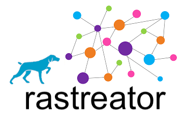

#### > Tool and collection of query files to explore Microsoft Active Directory


## Contents

1. [What is rastreator?](#1-what-is-rastreator)
2. [What does rastreator solve?](#2-what-does-rastreator-solve)
3. [Interesting features](#3-interesting-features)
4. [Goals](#4-goals)
5. [Collection of query files](#5-collection-of-query-files)
6. [Query file](#6-query-file)
7. [Tool](#7-tool)
    1. [Check mode](#71-check-mode)
    2. [Command mode](#72-command-mode)
    3. [Execution mode](#73-execution-mode)
    4. [Interactive mode](#74-interactive-mode)
8. [Installation](#8-installation)
    1. [Using Git](#81-using-git)
    2. [Using docker](#82-using-docker)
9. [Demos](#9-demos)
    1. [Check mode](#91-check-mode)
    2. [Command mode](#92-command-mode)
    3. [Execution mode](#93-execution-mode)
    4. [Interactive mode](#94-interactive-mode)
10. [FAQ](#10-faq)
11. [Similar projects](#11-similar-projects)


## 1. What is rastreator?

Rastreator is a tool and collection of query files to obtain information, suggest potential attacks and discover issues in a Microsoft Active Directory domain.<br/>
Rastreator requires that:
- Sharphound gather Active Directory domain information,
- Bloodhound parse the gathered information and fill a Neo4j database.

After that, rastreator depends on:
- Neo4j to store the filled information and execute Cypher queries to obtain interesting information or issues.

The collection of query files, the core of this project, is grouped by tactics (Mitre ATT&CK).<br/>
We encourage everyone to share with us their Cypher sentences or query files to improve the collection and the community knowledge.

The tool is a python script (rastreator.py) that executes queries and obtains results.<br/>
It provides different:
- Operation modes to work in background, interactively or programmatically.
- Output formats to analyse the results on screen or save them to disk.


## 2. What does rastreator solve?

[BloodHound](https://github.com/BloodHoundAD/BloodHound) is a great exploration tool and has some awesome queries, like "Shortest path to Domain Admins", but in general, it has three main drawbacks:
- It is not easy to develop and test new queries with it and you end up directly using Neo4j's browser interface for this goal,
- It provides a Linkurious GUI to interact manually but sometimes you need raw data instead of cool graphs and a way to automate a bunch of queries. For this reason, projects like [CypherDog](https://github.com/SadProcessor/CypherDog) exist,
- It does not have a great collection of queries.

Rastreator solves all of them:
- It has a rich interactive mode, to develop and test new queries,
- It provides raw data in different formats (CSV, JSON or YAML),
- It has a good (that will become great :-) collection of queries to assist Red/Blue Teamers, Pentesters and Auditors with valuable queries,
- It has two operation modes (command and execute) to automate the discovery process over a bunch of queries.


## 3. Interesting features

- Different operation modes: check, command, execute and interactive.
- Different execute sub-modes (raw, test and default) that require different internal structure and metadata fields in query files, for those of you more interested in executing Cypher sentences than documenting them.
- Metadata for query files, beyond name and description, like for example: author, state, tactic, tag, external references and next steps for Red/Blue Teams.
- Cypher sentences in query files that allow placeholder variables to support different domain names, Active Directory languages and BloodHound versions.
- Different screen output formats: CSV, JSON, table and YAML.
- Different persistence formats: CSV, JSON and YAML.


## 4. Goals

The main goal is to improve the collection of query files and to achieve it we set the following sub-goals:
- Share and centralize query files.
- Research and create new query files.
- Recollect and format, dispersed Cypher sentences on the Internet, in query files.
- Promote community collaboration.


## 5. Collection of query files

The core of this project is a collection of query files under the queries/ directory. Each query file belongs to one of the following categories/tactics (mapping the Mitre ATT&CK Framework):
- queries/
    - collection/
    - credential_access/
    - discovery/
    - execution/
    - lateral\_movement/
    - persistence/
    - privilege\_escalation/

As you can imagine, executing queries in one category provides results to achieve or detect that tactical goal in a domain.<br/>
We encourage everyone, from a Red or Blue Team perspective, to collaborate and share with us their Cypher sentences or query files to improve the collection of query files.


## 6. Query file

A query file has a different internal structure depending on the targeted execute sub-mode (raw, test, default):

- raw: the query file is a regular text file with one or more Cypher sentences, one per line.
- test: the query file is a YAML file that contains required (name and sentence-table) and optional (sentence-count, sentence-graph) metadata.
- default: the query file is a YAML file that contains some required and optional metadata.

Next, we will describe the required and optional metadata for a query file valid in default execute sub-mode and candidate to be added to the collection of query files.

Metadata fields:

- author (required): Query author name.
- name (required): Query name using underscores instead of spaces.
- state (required): Only enabled queries will be executed. Valid values (choose one):
    - enabled
    - disabled
- tactic (required): Query tactical goal. Also needed to compute statistics. Valid values (choose one):
    - collection
    - command and control
    - credential access
    - defense evasion
    - discovery
    - execution
    - exfiltration
    - impact
    - initial access
    - lateral movement
    - persistence
    - privilege escalation
- tag (required): Another way to classify queries. Also needed to compute statistics. Valid values (choose one):
    - analysis: Analysis queries provide results to analyse.
    - attack: Attack queries provide results with information to perform an attack as the next step.
    - issue: Issue queries provide results pointing to a vulnerability or an incorrect configuration, but also can be used to perform an attack as the next step.
- description (required): Summary of the query purpose.
- reference (optional): List of external URLs with information related to the query.
- nextsteps (optional): List of recommended next steps or tasks for a Red and Blue Team.
- sentence (required):
    - table (required): The main Cypher sentence of this query file. Results are given as text and can be printed on screen or saved to disk.
    - count (optional): A regular expression that converts the previous table sentence into a new one that provides a summary or statistics. Results are given as text and can be printed on screen or saved to disk.
    - graph (optional): A regular expression that converts the previous table sentence into a new one that provides a graphical representation. Currently, this query is not executed and the result is a Cypher sentence to be copy-pasted and executed in the Neo4j's browser interface.


## 7. Tool

The tool is a python script (rastreator.py) that executes queries and obtains results.
It provides different:
- Operation modes to work in background, interactively or programmatically.
- Output formats to analyse the results on screen or save them to disk.

```
RastreatorTeam@localhost$ python3 rastreator.py -h
usage: rastreator.py [-h] {check,command,execute,interactive} ...

Rastreator
 > Tool and collection of query files to explore Microsoft Active Directory
 > Developed by @interh4ck and @t0-n1

positional arguments:
  {check,command,execute,interactive}
    check               Check mode
    command             Command mode
    execute             Execute mode
    interactive         Interactive mode

optional arguments:
  -h, --help            show this help message and exit
```

Positional arguments:
- check: This mode checks the correctness of one or more query files.
- command: This mode executes one Cypher sentence passed as a one-liner command.
- execute: This mode executes in batch mode one or more query files.
- interactive: This mode provides a REPL shell with autocomplete support and allows the execution of multiple Cypher sentences in a single session.


### 7.1. Check mode

This mode checks the correctness of one or more query files. We suggest to execute this mode before doing a pull request to share your query files with us.

```
RastreatorTeam@localhost$ python3 rastreator.py check -h
usage: rastreator.py check [-h] [-v {quiet,default,debug}] [-I INPUT_DIRECTORY_OR_FILE]
                           [-O OUTPUT_DIRECTORY] [-o {none,yaml}]

optional arguments:
  -h, --help            show this help message and exit
  -v {quiet,default,debug}
                        Verbose mode
  -I INPUT_DIRECTORY_OR_FILE
                        Input directory or specific query file
  -O OUTPUT_DIRECTORY   Output directory to save results
  -o {none,yaml}        File format to save executed query results
```

Optional arguments:

- -v {quiet,default,debug}: Verbosity level for screen output. Default: default.
- -I INPUT\_DIRECTORY\_OR\_FILE: Input directory with query files or a specific query file to check. Default: queries.
- -O OUTPUT\_DIRECTORY: Output directory to save the new generated query files. Default: output.
- -o {none,yaml}: Select 'yaml' to save to disk the new generated query files in YAML format. Select 'none' to do not save anything. Default: yaml.

Watch the check mode [demo](#91-check-mode).


### 7.2. Command mode

This mode executes a Cypher sentence passed as a one-liner command. It eases programmatically integration with other tools.

```
RastreatorTeam@localhost$ python3 rastreator.py command -h
usage: rastreator.py command [-h] [-v {quiet,default,debug}] [-H NEO4J_HOST] [-P NEO4J_PORT]
                             [-u NEO4J_USERNAME] [-p NEO4J_PASSWORD] [-e {off,on}] [-c COMMAND]

optional arguments:
  -h, --help            show this help message and exit
  -v {quiet,default,debug}
                        Verbose mode
  -H NEO4J_HOST         Neo4j host to connect
  -P NEO4J_PORT         Neo4j port to connect
  -u NEO4J_USERNAME     Neo4j username
  -p NEO4J_PASSWORD     Neo4j password
  -e {off,on}           Neo4j encrypted communication
  -c COMMAND            Semicolon separated shell commands inside single/double quotes
```

Optional arguments:

- -v {quiet,default,debug}: Verbosity level for screen output. Default: default.
- -H NEO4J\_HOST: IP address or hostname of your Neo4j database. Default: localhost.
- -P NEO4J\_PORT: Port number of your Neo4j database. Default: 7687.
- -u NEO4J\_USERNAME: The username to login in your Neo4j database. Default: neo4j.
- -p NEO4J\_PASSWORD: The password to login in your Neo4j database. Default: neo4j.
- -e {on,off}: Select 'on' if communication to your Neo4j database is encrypted, elsewhere select 'off'. Default: on.
- -c COMMAND: List of internal shell commands to execute separated by semicolons.

Watch the command mode [demo](#92-command-mode).


### 7.3. Execution mode

This mode executes in batch mode one or more query files. It's possible to execute query files without all the required metadata fields using sub-modes (raw or test).

```
RastreatorTeam@localhost$ python3 rastreator.py execute -h
usage: rastreator.py execute [-h] [-v {quiet,default,debug}] [-H NEO4J_HOST] [-P NEO4J_PORT]
                             [-u NEO4J_USERNAME] [-p NEO4J_PASSWORD] [-e {off,on}]
                             [-I INPUT_DIRECTORY_OR_FILE] [-O OUTPUT_DIRECTORY]
                             [-o {csv,json,none,yaml}] [-m {raw,test,default}]
                             [-f {csv,json,table,yaml}] [-l {en,es}] -d AD_DOMAIN

optional arguments:
  -h, --help            show this help message and exit
  -v {quiet,default,debug}
                        Verbose mode
  -H NEO4J_HOST         Neo4j host to connect
  -P NEO4J_PORT         Neo4j port to connect
  -u NEO4J_USERNAME     Neo4j username
  -p NEO4J_PASSWORD     Neo4j password
  -e {off,on}           Neo4j encrypted communication
  -I INPUT_DIRECTORY_OR_FILE
                        Input directory or specific query file
  -O OUTPUT_DIRECTORY   Output directory to save results
  -o {csv,json,none,yaml}
                        File format to save executed query results
  -m {raw,test,default}
                        Execute submode
  -f {csv,json,table,yaml}
                        Output format to show executed query results on screen
  -l {en,es}            Active Directory language
  -d AD_DOMAIN          Active Directory domain name
```

Optional arguments:

- -v {quiet,default,debug}: Verbosity level for screen output. Default: default.
- -H NEO4J\_HOST: IP address or hostname of your Neo4j database. Default: localhost.
- -P NEO4J\_PORT: Port number of your Neo4j database. Default: 7687.
- -u NEO4J\_USERNAME: The username to login in your Neo4j database. Default: neo4j.
- -p NEO4J\_PASSWORD: The password to login in your Neo4j database. Default: neo4j.
- -e {on,off}: Select 'on' if communication to your Neo4j database is encrypted, elsewhere select 'off'. Default: on.
- -I INPUT\_DIRECTORY\_OR\_FILE: Input directory with query files or a specific query file to execute. Default: queries.
- -O OUTPUT\_DIRECTORY: Output directory to save the new generated query files. Default: output.
- -o {csv,json,none,yaml}: Select 'csv', 'json' or 'yaml' to save to disk the query results in CSV, JSON or YAML format. Select 'none' to do not save results to disk. Default: csv.
- -m {raw,test,default}: Select 'raw' to use query files without metadata, only Cypher sentences one per line. Select 'test' to use query files with a minimal metadata (name and sentence-table are required). Finally, select 'default' to use query files with a complete format. Default: default.
- -f {csv,json,table,yaml}: Select 'csv', 'json', 'table' or 'yaml' to output the query results to screen in CSV, JSON or YAML format. Select 'none' to do not output results to screen. Default: table.
- -l {en,es}: Select 'en' or 'es' to use English or Español as the Active Directory language. It is easy to add more languages, please check the [FAQ](#10-faq) section. Default: en.
- -d AD_DOMAIN: Active Directory domain name.

Watch the execution mode [demo](#93-execution-mode).


### 7.4. Interactive mode

This mode provides a REPL shell with autocomplete support and allows the execution of multiple Cypher sentences in a single session. It is the best mode to develop and test new Cypher sentences.

```
RastreatorTeam@localhost$ python3 rastreator.py interactive -h
usage: rastreator.py interactive [-h] [-v {quiet,default,debug}] [-H NEO4J_HOST] [-P NEO4J_PORT]
                                 [-u NEO4J_USERNAME] [-p NEO4J_PASSWORD] [-e {off,on}]

optional arguments:
  -h, --help            show this help message and exit
  -v {quiet,default,debug}
                        Verbose mode
  -H NEO4J_HOST         Neo4j host to connect
  -P NEO4J_PORT         Neo4j port to connect
  -u NEO4J_USERNAME     Neo4j username
  -p NEO4J_PASSWORD     Neo4j password
  -e {off,on}           Neo4j encrypted communication
```

Optional arguments:

- -v {quiet,default,debug}: Verbosity level for screen output. Default: default.
- -H NEO4J\_HOST: IP address or hostname of your Neo4j database. Default: localhost.
- -P NEO4J\_PORT: Port number of your Neo4j database. Default: 7687.
- -u NEO4J\_USERNAME: The username to login in your Neo4j database. Default: neo4j.
- -p NEO4J\_PASSWORD: The password to login in your Neo4j database. Default: neo4j.
- -e {on,off}: Select 'on' if communication to your Neo4j database is encrypted, elsewhere select 'off'. Default: on.

```
RastreatorTeam@localhost$ python3 rastreator.py interactive
Rastreator
 > Tool and collection of query files to explore Microsoft Active Directory
 > Developed by @interh4ck and @t0-n1

> help
Commands:
- exit: this program (ctrl+d)
- help: shows this help
- set: the environment variables

Match Query:
  Example: > match (u:User{enabled:true}) return u.name limit 10

> set
domain = RASTREATOR.LOCAL
lang = en
multiline = off
output = table

> set output csv
             json
             table
             yaml
```

Commands:

- set: Shows the environment variables.
- set domain AD_DOMAIN: Set the Active Directory domain name.
- set lang {en,es}: Select 'en' or 'es' to use English or Español as the Active Directory language. It is easy to add more languages, please check the [FAQ](#10-faq) section. Default: en.
- set multiline {on,off}: Select 'on' to write and edit a Cypher sentence in multiple lines, elsewhere select 'off'. Default: off.
- set output {csv,json,table,yaml}: Select 'csv', 'json', 'table' or 'yaml' to output the Cypher sentence results to screen in CSV, JSON or YAML format. Default: table.

Watch the interactive mode [demo](#94-interactive-mode).


## 8. Installation


### 8.1. Using Git

```
$ git clone https://github.com/RastreatorTeam/rastreator.git
$ python3 -m venv rastreator
$ source rastreator/bin/activate
(rastreator) $ cd rastreator
(rastreator) $ pip3 install -r requirements
(rastreator) $ python3 rastreator.py -h
```


### 8.2. Using docker

```
$ git clone https://github.com/RastreatorTeam/rastreator.git
$ sudo docker build -t rastreatorteam/rastreator .
$ sudo docker run --rm -it rastreatorteam/rastreator -h
```

Use the -v option to mount another query directory into the container:

```
$ sudo docker run --rm -it -v {host_directory}:{container_mount_point} rastreatorteam/rastreator -h
```


## 9. Demos


### 9.1. Check mode

#### File as input

[](https://asciinema.org/a/hUmovcbccQDL84hopGlPEdQ3R)

#### Directory as input

[](https://asciinema.org/a/UQny2K5MyPhK6LDLXsAi8JReT)


### 9.2. Command mode

[](https://asciinema.org/a/xo8UvIefb0uoTuVS6IJgtCWlh)


### 9.3. Execution mode

#### Raw sub-mode with file as input

[](https://asciinema.org/a/CUdqp9yIIyK9pHruqf0KC9rjP)

#### Test sub-mode with file as input

[](https://asciinema.org/a/DObtdDXtQux6oPdp75DZ4wUud)

#### Default sub-mode with file as input

[](https://asciinema.org/a/FEPV4l3pNYwpoJTrQKapbzAXu)

#### Default sub-mode with directory as input

[](https://asciinema.org/a/Rep0tQwfnklwvcDf2B6bOL2fQ)


### 9.4. Interactive mode

[](https://asciinema.org/a/HgnSrTAdQfaTqZU4FiDRaMdbo)


## 10. FAQ


#### How can I share my query file with you?

First, watch the check mode [demo](#91-check-mode).<br/>
Second, check you query file in the same way.<br/>
Finally, get the new generated file and do a pull request.


#### Could you support more Active Directory languages?

Sure, check the conf/languages.yaml file and update it with the variables for you language.<br/>
After that, please do a pull request.


#### How can I persistently set my defaults?

Edit the conf/defaults.yaml file.


## 11. Similar projects

Recently, during our private development, we observed the emergence of the following similar projects, each one with its particularities:

- [PlumHound](https://github.com/DefensiveOrigins/PlumHound)
- [BloodHound Notebook](https://github.com/OTRF/bloodhound-notebook)
